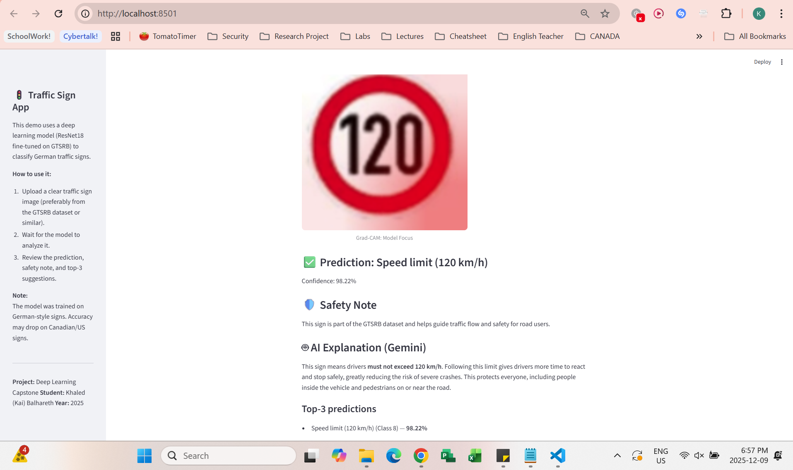

---

# 🛑 Traffic Sign Classifier (GTSRB)

**Deep Learning Capstone – 2025**
**Author:** Khaled (Kai) Balhareth – 1250916

This project is an interactive **Streamlit web app** that classifies **German traffic signs** using a fine-tuned **ResNet18** model.
It includes **Grad-CAM visualizations** and **AI explanations (Gemini)** for interpretability.

---

## 🚦 Features

* ✔️ **Traffic sign classification** using ResNet18
* ✔️ **Grad-CAM heatmaps** to show what the model focuses on
* ✔️ **Safety notes** for each sign
* ✔️ **Top-3 predictions**
* ✔️ **Gemini AI explanation** (optional)
* ✔️ Clean UI with sidebar instructions
* ✔️ Fully interactive Streamlit app

---

## 🖼️ Demo Screenshot




---

## 🧠 Model Details

**Architecture:** ResNet18 (PyTorch)
**Dataset:** GTSRB – German Traffic Sign Recognition Benchmark
**Training:** Fine-tuned for classification
**Limitation:** Accuracy may drop on Canadian/US signs (different shapes & colors)

---

## 🔍 Grad-CAM

Grad-CAM highlights the regions the model considers important for a prediction.
This improves interpretability and helps explain why the model thinks a sign is a certain class.

---

## 🤖 Optional: Gemini AI Explanation

has been added 

---

## ▶️ How to Run Locally

### **1. Create + activate virtual environment**

```bash
python -m venv venv
venv\Scripts\activate
```

### **2. Install dependencies**

```bash
pip install -r requirements.txt
```

### **3. Run Streamlit**

```bash
streamlit run app.py
```


---

## 📂 Project Structure

```
traffic-sign-capstone/
│
├── app.py
├── app - backup.py
├── resnet18_gtsrb_state_dict.pth
├── requirements.txt
├── .gitignore
└── README.md
```

---

### 🔗 Download Model Weights

The trained ResNet18 weights used in this project can be downloaded from the release page:

➡️ **[Download resnet18_gtsrb_state_dict.pth](https://github.com/StudiousMind/traffic-sign-capstone/releases/latest)**  


---

## 🎓 About

This project was developed as a Deep Learning Capstone at **Fanshawe College**.
It demonstrates a full ML pipeline:
Training → Deployment → Explainability → User Interface.

---

## 📬 Contact

**Email:** [KhaledBalharith@gmail.com](mailto:KhaledBalharith@gmail.com)

---


